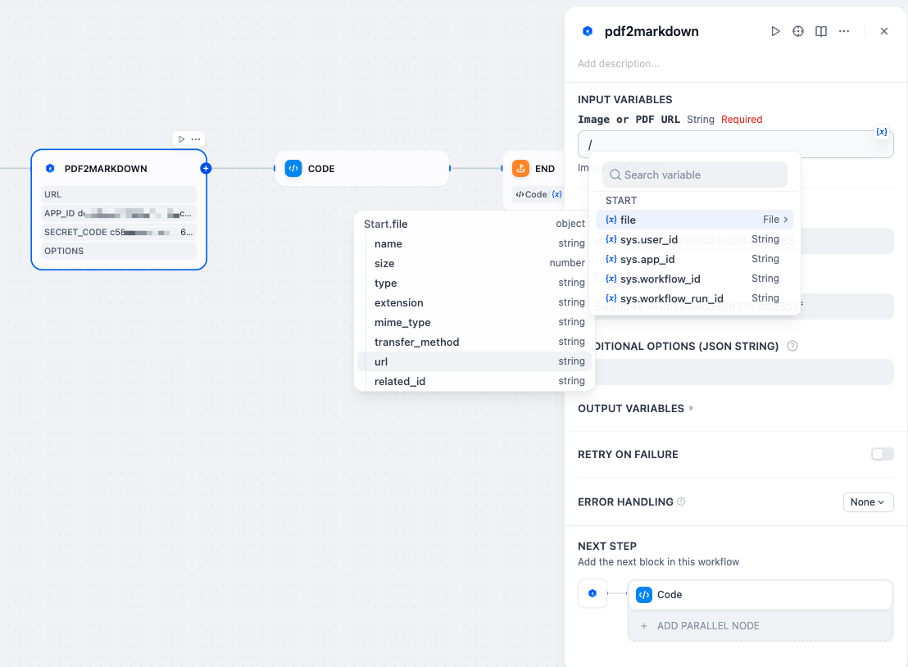
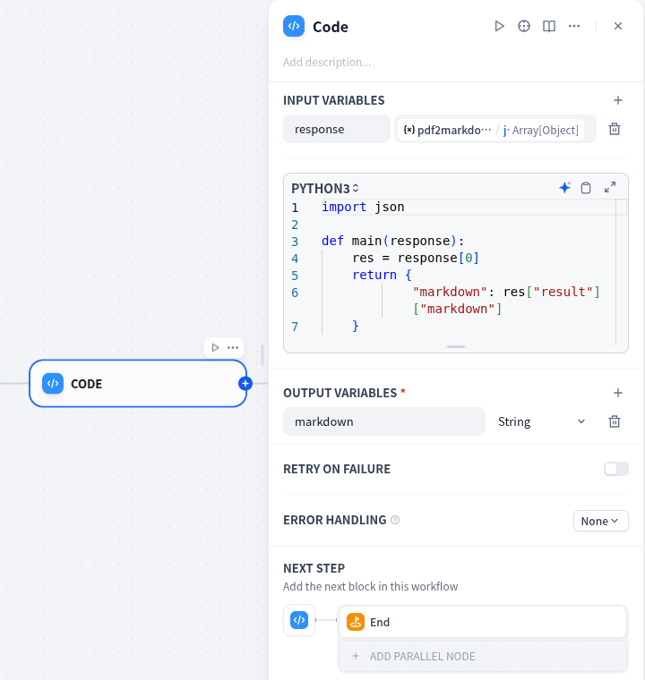

<!-- language -->

[English](README.md) | [简体中文](README_zh-CN.md)

# 通用文档解析

**作者:** 合合信息

**版本:** 1.1.0

**分类:** tool

# 简介

[TextIn OCR](https://www.textin.com/market/detail/pdf_to_markdown) 是一款通用文档解析服务，专为大语言模型（LLM）的下游任务设计。它可从文档或图像中识别文本信息，包括财报、国家标准、学术论文、企业公告、用户手册、发票等，并提取关键信息，支持将文档内容还原为标准 Markdown 格式。TextIn 提供涵盖 10 多种常见文档版式的 OCR 文本识别，支持 52+ 种语言，助力大模型在理解、生成、问答等场景中高效利用文档数据。

# 使用指南

1. 从TextIn平台获取appid和secret code，参考下文的Q&A；
2. 在Dify工作流中，添加「pdf2markdown」插件，并将第1步的appid和secret code填入参数面板中；
   
3. 在「开始」节点增加一个输入项，选择「单文件」，变量名任意定义，并设置文件格式为文档和图片，TextIn同时都支持；最下方的上传方式选择上传和URL同时支持；
   
4. 在文档解析节点，在输入变量框中，键入“/”，唤起变量绑定面板，并依次选择 file -> url，即可绑定到开始节点中上传的文件；
   
5. 通过Options添加额外的参数，以json字符串的格式填入，如"{'markdown_details':1, 'get_image': 'objects',}"，更多参数请参考TextIn官方API文档；https://www.textin.com/document/pdf_to_markdown
6. 添加一个代码节点，处理返回结果；这里以获取markdown为例，将pdf2markdown的输出整体绑定到「代码」节点的输入变量上，如"response"，然后用python3来处理数据，代码如下：
   

```python
import json

def main(response):
    res = response[0]
    return {
            "markdown": res["markdown"]
    }
```

# 功能特点

* 高精度表格识别： 能准确识别有无边框、密集型、跨页、合并单元格等各种表格。
* 极速解析： 最快可在 1.5 秒内完成百页文档解析，极大提升在线使用体验，降低离线处理耗时。
* 高稳定性： 每日可稳定处理百万级请求，成功率达 99.999%，已在亿级用户应用中验证。
* 广泛格式支持： 单一 API 支持 PDF、Word（doc/docx）、常见图片（jpg/png/webp/tiff）、HTML 等多种格式，可一次性提取文本、表格、标题层级、公式、手写字符和图片信息。

# 应用场景

* 财报数据提取： 快速提取财务报告、研报等文档中的关键数据，标准化后支持分析与决策。
* 题库清洗： 高效解析教材、试卷等文档，提取并规范题目内容，提升题库构建效率。
* RAG 知识库构建： 将非结构化文档内容结构化为知识块，助力 RAG 检索增强生成应用。
* 格式保留翻译： 结合 OCR 和结构分析，实现多语言文档的翻译并保留原始排版。
* 在线阅卷与自动评分： 识别学生答案并结构化，支持自动评分与结果分析。
* 文档智能问答系统： 将文档解析为可检索格式，提升基于文档的智能问答效率。
* RPA/Agent 自动化： 作为机器人流程自动化（RPA）或智能代理的预处理模块，实现文档识别、内容提取与智能分发。

# Q&A

**问：TextIn 支持哪些类型的文档？**
答：支持包括图片（JPG、PNG 等）、PDF、Word（DOC/DOCX）、HTML、Excel 等在内的多种格式。

**问：TextIn 支持哪些语言的文字识别？**
答：目前支持 52+ 种语言，包括中文、英文、日语、韩语、德语、法语等主流语言。

**问：文档解析后的输出格式是什么？**
答：默认输出为结构化 Markdown 格式，也支持 JSON 格式用于内容提取。

**问：使用是否有限制？**
答：根据订阅方案和账户类型不同，调用次数和并发量等方面可能存在限制。详情请参考 TextIn 官方文档。

**问：如何获取和管理 API 密钥？**
答：在 [TextIn OCR](https://www.textin.com/register/code/68KPRK) 注册后，可在 [用户中心](https://www.textin.com/console/dashboard/setting) 获取并管理 APP ID 与 APP SECRET，用于调用 TextIn OCR 服务。

**问：是否支持批量文档处理？**
答：支持。通过 API 可批量上传文档进行识别与解析，适合大规模文档处理。

**问：解析后的文档能否保留原始版式？**
答：TextIn 会根据常规阅读顺序还原文档结构，极复杂版式可能略有调整。

**问：是否提供 SDK 或示例代码？**
答：提供。TextIn 提供多语言 SDK（如 Python、Java）及完整 API 使用示例，方便快速集成。